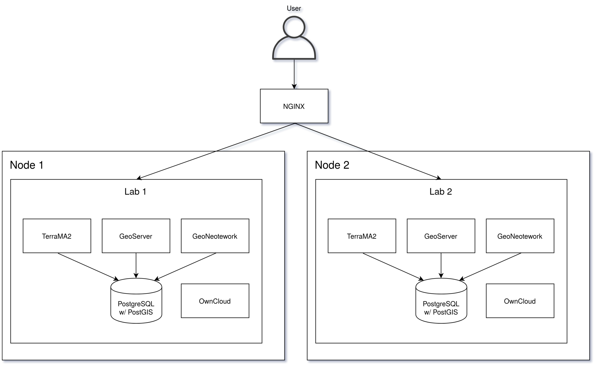

# environment configuration

This page presents an environment configuration approach that can be used to use the services.

## Create Kubernetes cluster

For the creation of cluster `kind` or `dind` can be used

### dind configuration

run the script `cluster/dind-cluster/dind-cluster-v1.13.sh`

```shell
chmod +x environment/dind-cluster/dind-cluster-v1.13.sh

environment/dind-cluster/dind-cluster-v1.13.sh
```

### kind configuration (recommended)

To use kind run `setup.sh` script.


```shell
chmod + environment/setup.sh
environment/setup.sh
```

> Note that all environment testing has been done on `kind`, so this is the recommended testing environment.

### About

The settings of this repository generate a structure similar to the one below.


